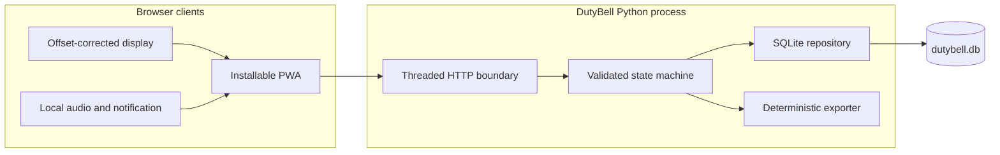
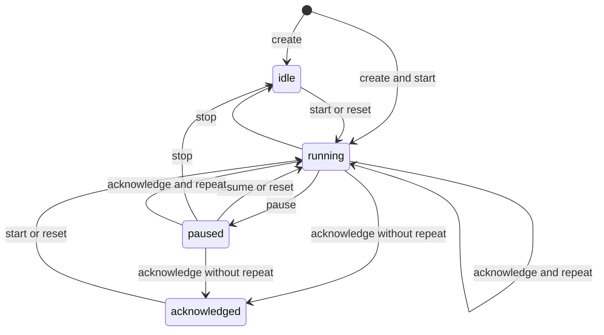

# Architecture

DutyBell deliberately uses one Python process, one SQLite file, and browser-native APIs. The
constraint keeps a household deployment inspectable and makes backup and recovery concrete.

## Components



| Layer | Responsibility | Explicit non-responsibility |
| --- | --- | --- |
| `server.py` | HTTP parsing, limits, authentication boundary, status mapping, static allowlist | Timer policy |
| `service.py` | Validation and every legal room transition | SQL and transport |
| `store.py` | Schema, transactions, key digests, version conflicts, event persistence | Business decisions |
| `models.py` | Immutable room/event records and public snapshots | Persistence |
| `exporter.py` | Portable archive creation and verification | Import or key recovery |
| `static/` | Rendering, clock alignment, long polling, local alerts | Authoritative state |
| `cli.py` | Operator commands and diagnostics | Alternate state logic |

## State model

Room states are `idle`, `running`, `paused`, and `acknowledged`.



`claim` and `configure` update metadata without bypassing the state machine. Every accepted
mutation increments `version` exactly once and appends exactly one event in the same SQLite
transaction.

## Clock and synchronization contract

The database stores `deadline_at_ms` as an absolute UTC Unix timestamp. A browser measures the
request start and finish times and treats their midpoint as the best estimate of when the server
sample was produced. This makes a phone with a moderately wrong wall clock display the same
remaining duration as other clients without attempting global clock synchronization.

Clients long-poll `/wait?after=VERSION`. The store uses a per-process condition variable to wake
waiting requests immediately after a successful mutation and always rereads SQLite before
responding. A timeout is a normal unchanged result, not an error.

Mutations carry `expected_version`. The store starts `BEGIN IMMEDIATE`, rereads the room, compares
the version, writes the complete next state, and appends its event before commit. A stale caller
receives `409` plus the current public room snapshot.

This is multi-client synchronization for one process. Running multiple DutyBell processes against
one database is not supported in v0.1.0 because condition-variable wakeups are process-local.

## Persistence and recovery

SQLite enables WAL mode, foreign keys, and a busy timeout. Room access keys are generated with the
operating system CSPRNG; only SHA-256 digests are persisted and comparison is constant-time. The
plaintext key is returned only when the room is created.

For a consistent backup while the server is running, use SQLite's backup command rather than
copying only the main file:

```bash
sqlite3 dutybell.db ".backup 'dutybell-backup.db'"
```

Restore while DutyBell is stopped, retain the original until `dutybell doctor` succeeds against
the restored path, and then start the service. Schema migrations must be forward-only and covered
by tests when introduced.

## Design invariants

1. The browser never decides the canonical state or next version.
2. A failed or stale mutation appends no event.
3. A successful mutation and its event are atomic.
4. Public responses and exports never contain the access-key digest.
5. Archives are verified without extracting attacker-controlled paths.
6. Packaged static files come from a fixed allowlist.
7. Runtime behavior does not require the public internet or third-party JavaScript.
